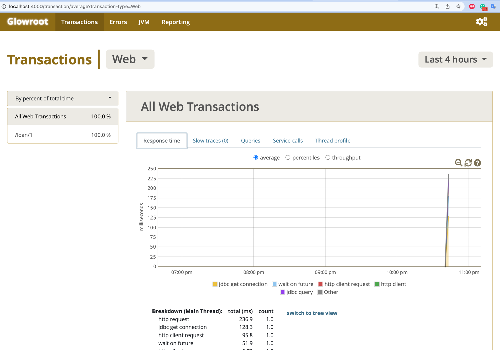
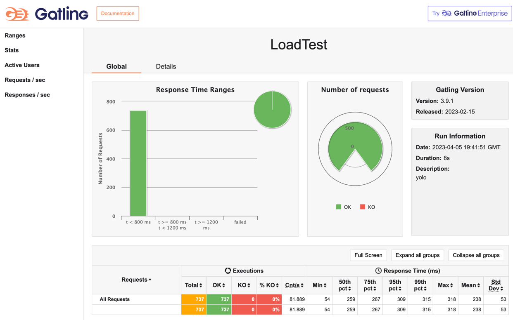

# Java Performance Profiling Workshop

### Install Lombok
If necessary using https://www.baeldung.com/lombok-ide

### Start the Database
- [▶️ Run StartDatabase](src/main/java/victor/training/performance/helper/StartDatabase.java) to start a standalone in-memory H2 database running at `jdbc:h2:tcp://localhost:9092/~/test` (user=`sa`, password=`sa`).
- Traffic to database will be delayed by a [network proxy](src/main/java/victor/training/performance/helper/NetworkLatencyProxy.java) started on port `19092`. 
- (Optional) Connect to the database from IntelliJ (or your tool of coice) through the proxy via URL: `jdbc:h2:tcp://localhost:19092/~/test`.

### Start the Second App
- [▶️ Run SecondApp](src/main/java/victor/training/performance/helper/SecondApp.java) to start a second application called by the first one.

### Start the Profiled App
- [▶️ Run ProfiledApp](src/main/java/victor/training/performance/profiling/ProfiledApp.java) to start the application we will study.

### Instrument the Profiled App with Glowroot
Glowroot is a lightweight Java Agent that collects performance metrics and profiler results.
- Download the dist zip from [glowroot.org](https://glowroot.org/).
- Unzip it and copy the path to the `glowroot.jar`.
- Add `-javaagent:/path/to/glowroot.jar` to the 'VM options' of your run configuration of ProfiledApp to instrument it.
- Open http://localhost:4000 to see the Glowroot UI:

### Run the Load Tests
- [▶️ Run LoadTest](src/test/java/LoadTest.java), and click the links printed at the end  
- Inspect the generated Gatling report, looking like this:

- Study the flamegraph by opening this link: http://localhost:4000/transaction/thread-flame-graph?transaction-type=Web

### Optimization steps
1. Avoid useless network call from @Aspect
   - restTemplate.getForObject sometimes does not have to run: reorder lines
   - Observe: the time spent in the aspect is gone
2. Fix JDBC Connection Starvation issue:
   - Observe the Hikari getConnection time in the flamegraph
   - [Optional] increase Hikari connection pool size -> starvation fixed; UNDO
   - Make getLoanApplication not @Transactional -> no change :( 
   - Release the JDBC Connection earlier by `spring.jpa.open-in-view=false`
3. Lazy loading in toString
   - Observe: LoanApplication.toString performs a lazy load
   1) Use log.trace("... {}", loanApplication) instead of log.trace("..." + loanApplication)
   2) Fix the lazy load by manually creating a toString that does not include the collection fields/@ToString.Exclude
4. Fix the Apache HTTP Client connection pool
   - Observe: time is spent to acquire a connection from the Apache Http connection pool
   - Remove `feign.httpclient.max-connections-per-route` from application.properties

### Add the open-telemetry agent (optional: requires local Docker)
- Start the monitoring-otel docker compose
- Download the OTEL agent from [https://github.com/open-telemetry/opentelemetry-java-instrumentation/releases](here)
- Add to your VM options: `-javaagent:/path/to/opentelemetry-javaagent.jar -Dotel.instrumentation.micrometer.enabled=true -Dotel.metric.export.interval=500 -Dotel.bsp.schedule.delay=500`

Import https://grafana.com/grafana/dashboards/19004-spring-boot-statistics/