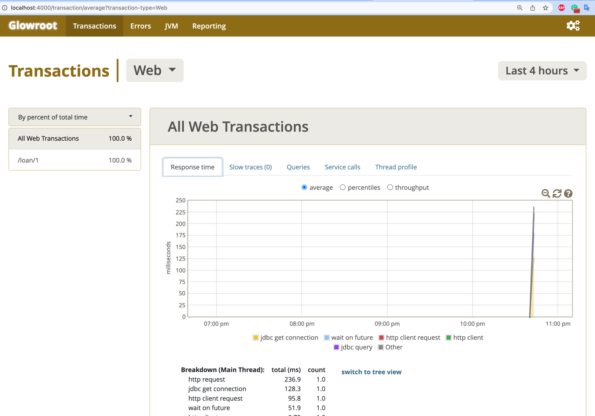
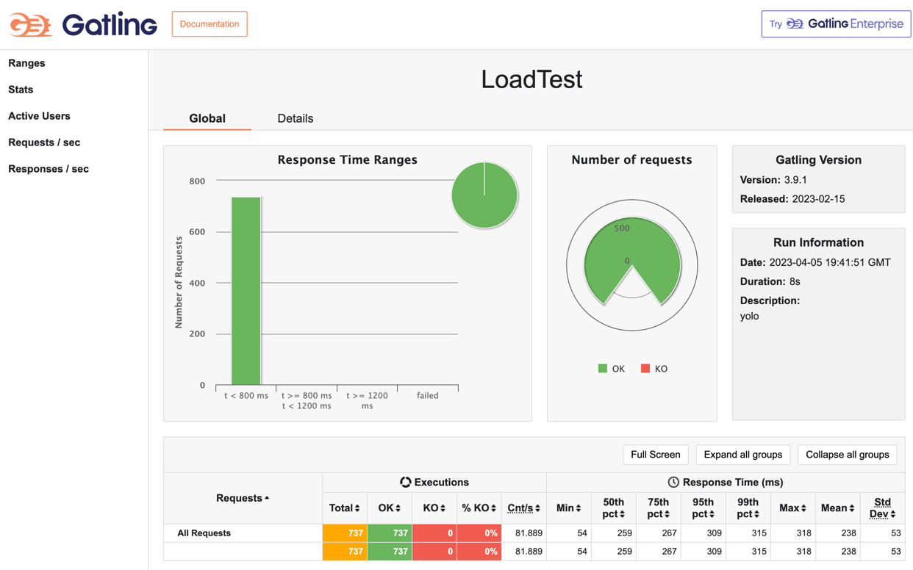

# Java Performance Profiling Workshop

## Setup

### 1. Start the Database
- [▶️ Run StartDatabase](src/main/java/victor/training/performance/helper/StartDatabase.java) to start a standalone in-memory H2 database at `jdbc:h2:tcp://localhost:9092/~/test` (user=`sa`, password=`sa`)
- Traffic is delayed by a [network proxy](src/main/java/victor/training/performance/helper/NetworkLatencyProxy.java) on port `19092`
- (Optional) Connect from IntelliJ through the proxy: `jdbc:h2:tcp://localhost:19092/~/test`

### 2. Start the Second App
- [▶️ Run SecondApp](src/main/java/victor/training/performance/helper/SecondApp.java) to start the downstream service

### 3. Start the Profiled App
- [▶️ Run ProfiledApp](src/main/java/victor/training/performance/profiling/ProfiledApp.java) to start the main application

### 4. Instrument with Glowroot
Glowroot is a lightweight Java Agent for performance metrics and profiling.
- Download from [glowroot.org](https://glowroot.org/)
- Add to VM options: `-javaagent:/path/to/glowroot.jar`
- Open UI: http://localhost:4000



### 5. Run Load Tests
- [▶️ Run LoadTest](src/test/java/LoadTest.java) and click the generated report link
- Study the flamegraph: http://localhost:4000/transaction/thread-flame-graph?transaction-type=Web



## Optimization Steps

### 1. Avoid Useless Network Call from @Aspect
- `restTemplate.getForObject` sometimes runs unnecessarily: reorder guard clauses
- Observe: aspect execution time eliminated

### 2. Fix JDBC Connection Starvation
- Observe: Hikari `getConnection` time in flamegraph
- (Optional) Increase Hikari pool size → starvation fixed; UNDO
- Remove `@Transactional` from `getLoanApplication` → no change
- Release connections earlier: `spring.jpa.open-in-view=false`

### 3. Fix Lazy Loading in toString
- Observe: `LoanApplication.toString` triggers lazy load
- Solutions:
  1. Use `log.trace("... {}", loanApplication)` instead of string concatenation
  2. Add `@ToString.Exclude` on collection fields or create manual `toString`

### 4. Fix Apache HTTP Client Connection Pool
- Observe: time spent acquiring connection from pool
- Remove `feign.httpclient.max-connections-per-route` from `application.properties`

## Bonus: JFR vs async-profiler (kernel-level cliff)

A port of Andrei Pangin's [demo3](https://github.com/apangin/java-profiling-presentation):
reading a file with a 32 MB buffer is dramatically slower than with a 31 MB
buffer because glibc routes ≥ 32 MB allocations through `mmap`, faulting fresh
zero pages on every read. JFR is blind (both runs show only `FileInputStream.read`);
async-profiler reveals the native frames.

- Source: [`BufferSizeDemo.java`](src/main/java/victor/training/performance/profiling/BufferSizeDemo.java) — plain `main()`, no Spring
- Run locally (macOS): click ▶️ on `main` — but the cliff is muted (different allocator)
- Reproduce the real cliff: start Docker Desktop, then
  ```
  ./docker/buffer-demo/run.sh
  ```
  Produces `out/buffer-demo.jfr`, `out/flame-31mb.html`, `out/flame-32mb.html`.
  Open the two flamegraphs side-by-side.

## Optional: OpenTelemetry Instrumentation

Requires local Docker.

1. Start monitoring: `docker-compose -f grafana-otel-lgtm.yml up`
2. Download the OTel Java agent jar — easiest is to grab it from the
   [`docker-otel-lgtm`](https://github.com/grafana/docker-otel-lgtm) kit so
   the pre-wired run configs (see below) resolve out of the box:
   ```bash
   cd ~/Downloads
   curl -L -o docker-otel-lgtm-main.zip \
     https://github.com/grafana/docker-otel-lgtm/archive/refs/heads/main.zip
   unzip docker-otel-lgtm-main.zip
   ls docker-otel-lgtm-main/examples/java/opentelemetry-javaagent-v2.1.0.jar
   ```
   (Or download from
   [opentelemetry-java-instrumentation releases](https://github.com/open-telemetry/opentelemetry-java-instrumentation/releases)
   and adjust the VM args.)
3. Use the **ProfiledApp** and **SecondApp** run configs (shared, in
   `.idea/runConfigurations/`). They already include:
   ```
   -javaagent:$USER_HOME$/Downloads/docker-otel-lgtm-main/examples/java/opentelemetry-javaagent-v2.1.0.jar
   -Dotel.instrumentation.micrometer.enabled=true
   -Dotel.metric.export.interval=500
   -Dotel.bsp.schedule.delay=500
   ```
   The agent is what propagates trace context across `CompletableFuture` /
   `ForkJoinPool` worker threads — no `InheritableThreadLocal` involved.
4. Import Grafana dashboard: https://grafana.com/grafana/dashboards/19004-spring-boot-statistics/
